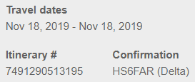

# 一号公路
**游客:** **L**y, **W**yf  
**时间:** 2019/11/15-2019/11/17
## 地图
https://drive.google.com/open?id=1pft3kStzVFOzqYzAeKykaU-WVmLUynse&usp=sharing
## 行程安排
* **周四 2019/11/14**
  * **L** 乘 **AS2790** 于 **22:43** 飞抵 SFO
    
    
  * **W** 乘 **SY397** 于 **22:59** 飞抵 SFO
    
    
  * 取车
    
    
  * 酒店  
    
    

* **周五 2019/11/15**  
  早上出发，途经半月湾和鸽点灯塔，午前至Santa Cruz，乘坐红树林蒸汽火车(12:30-14:00)！可选景点还有Mystery Spot(重力异常点)，Natural Bridges State Beach(天然石桥/洞，紫色沙滩)。下午途经彩虹镇Capitola，抵达蒙特雷。17英里路是私人海岸线景观可以考虑在此迎接日落，目前蒙特雷日落大约在18:00。晚上在蒙特雷or卡梅尔落脚。蒙特雷玩的比较多有水族馆，海滩，老码头，出海观鲸，跳伞……，选择性游览。卡梅尔海滩日落风光也不错，晚上可以去Carmel Plaza体验花园式购物。第一天纯赶路差不多2小时车程。  
  第一日早餐在旧金山，午餐在Santa Cruz，晚餐在蒙特雷。
  * Half Moon Bay
    
  * Pigeon Point Lighthouse
    
  * Santa Cruz, Redwood Forest, Natural Bridges State Beach
    
    
  * Capitola
    
  * Monterey, 17 Mile Drive, Carmel by the Sea
    
    
    
    
    
  * Stay night at Monterey.  
    https://zh.airbnb.com/z/q/790425548?bId=161355748&other_person_id=22064531  
    
* **周六 2019/11/16**  
  第二天行程不紧张，早上可以晚点出发， 也可以在蒙特雷多逛逛。这天基本都是拍照景点。晚上选择住在月石海滩是因为方便参观Hearst Castle。边上有个Elephant Seal Viewing Point，看海象的沙滩，不过这个季节可能看不到。第二天纯赶路差不多3~4小时。
  第二日早餐/午餐在蒙特雷，晚餐在月石滩。
  * Bixby Creek Bridge
    
  * Pfeiffer Beach(Big Sur), Julia Pfeiffer Burns State Park
    
  * McWay Falls
    
  * Moonstone Beach(貌似就是普通海滩)
    
  * Hearst Castle
    
  * Stay night at Moonstone Beach
    
    
* **周日 2019/11/17**  
  第三日路程较远，经过丹麦风情镇Solvang，西班牙风情镇Santa Barbara，马里布，最后回家。穆赫兰道彩蛋。第三日纯车程应该超过5小时。
  第三天这几个小镇都有很多特色美食，可以走走吃吃。
  * Solvang
    
  * Santa Barbara
    
  * Malibu, El Matador State Beach
    
  * 14 Northgrove  
    
* **Mon. 2019/11/18**
  * **W** leave at **14:15**, **DL 2089**.
    
    